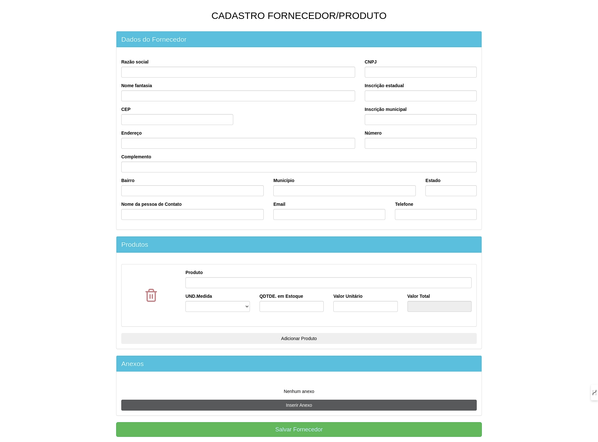

# Desafio Front-end

## Cadastro Fornecedor/Produto

#### Este projeto consiste na construção de um formulário para o cadastro de fornecedores e produtos

## Preview

### Tecnologias Utilizadas
+ HTML5: Estruturação e marcação do formulário.
+ CSS: Utilização do Fluig Style Guide e Bootstrap para estilização e layout.
+ JavaScript (ECMAScript 6+): Manipulação do DOM e lógica de funcionalidades.
+ jQuery (v3.5.1): Facilita a manipulação do DOM e gestão de eventos.
### Tarefas Concluídas
+ Estruturação do Formulário ✅
+ Funcionalidades JavaScript e jQuery ✅
+ Validações de Formulário ✅
+ Integração com API de CEP ✅
+ Modal de Loading ✅
+ Funcionalidade de Salvamento ✅
### Tarefa Pendente
+ Armazenamento com Blob ❌
  ######  A implementação da funcionalidade para armazenar documentos como objetos Blob não foi concluída. Enfrentei dificuldades técnicas ao tentar integrar o Blob, e a solução para essa tarefa requer um aprofundamento adicional.

### Aprendizado
##### Este desafio foi uma excelente oportunidade para aplicar e expandir meus conhecimentos em desenvolvimento web. A experiência envolveu trabalhar com diversas tecnologias e enfrentar problemas reais de implementação, o que proporcionou um aprendizado significativo em áreas como manipulação do DOM, validações de formulário, e integração com APIs.

## [Link do Desafio](https://github.com/VFLOWS/Teste-Estagio/blob/main/readme.md)

